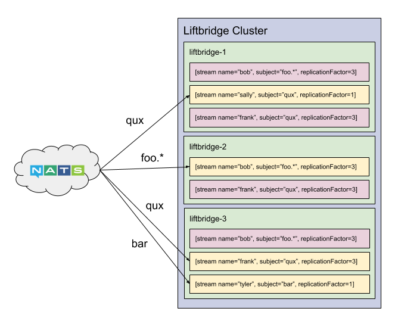

# Concepts

Liftbridge is a durable stream augmentation for NATS, so it's important to
have a good grasp of the [key concepts in
NATS](https://nats.io/documentation/concepts/nats-messaging/). NATS is a
pub/sub messaging system that centers around the concept of *subjects*. Clients
publish messages to subjects and receive messages from *subscriptions* to
subjects.

## Stream

Fundamentally, Liftbridge is just a consumer of NATS subjects. It receives
messages received from NATS subjects and records them in a durable log which
is then exposed to subscribers. Specifically, Liftbridge centers around the
concept of a *stream*, which is a durable message stream attached to a NATS
subject. A stream is ordered, replicated, and durably stored on disk and serves
as the unit of storage and parallelism in Liftbridge.

Streams have a few key properties: a subject, which is the corresponding NATS
subject, a name, which is a human-readable identifier for the stream, and a
replication factor, which is the number of nodes the stream should be
replicated to for redundancy. There can be multiple streams attached to the
same NATS subject, but within a given subject, the name must be unique. Thus, a
stream can be uniquely identified by the combination of its subject and name.

### Write-Ahead Log

Each stream is backed by a durable write-ahead log. All reads and writes to the
log go through the stream *leader*, which is selected by the cluster
[controller](#controller). The leader sequences each message in the stream and
sends back an acknowledgement to publishers upon committing a message to the
log. A message is committed to the log once it has been replicated to the
stream's [in-sync replicas set (ISR)](#in-sync-replicas-set-isr).

Consumers read committed messages from the log through a subscription on the
stream. They can read back from the log at any arbitrary position, or *offset*.
Additionally, consumers can wait for new messages to be appended to the log.

### Scalability

Liftbridge is designed to be clustered and horizontally scalable. The
[controller](#controller) is responsible for creating streams. When a stream is
created, the controller selects replicas based on the replication factor and
replicates the stream to the cluster. Once this replication completes, the
stream has been created and the leader begins processing messages.

As mentioned above, there can exist multiple streams attached to the same NATS
subject or even subjects that are semantically equivalent e.g. "foo.bar" and
"foo.*". Each of these streams will receive a copy of the message as NATS
handles this fan-out. However, the stream name is unique within a given
subject. For example, creating two streams for the subject "foo.bar" named
"foo" and "bar" respectively will create two streams which will independently
sequence all of the messages on the NATS subject "foo.bar", but attempting to
create two streams for the same subject both named "foo" will result in
creating just a single stream (creation is idempotent).

With this in mind, we can scale linearly by adding more nodes to the Liftbridge
cluster and creating more streams which will be distributed amongst the
cluster members. This has the advantage that we don't need to worry about
partitioning so long as NATS is able to withstand the load.

Alternatively, streams can join a named load-balance group, load balances
messages on a NATS subject amongst the streams in the group. Load-balance
groups do not affect message delivery to other streams.

Currently, replicas in Liftbridge act only as a mechanism for high availability
and not scalability. However, there may be work in the future to allow them to
act as read replicas for further scale out.

The diagram below shows a cluster of three servers with a set of streams.
Streams in yellow indicate the server is the leader for the stream.

### In-Sync Replicas Set (ISR)

TODO

### Acknowledgement

TODO

### Subscription

TODO

### Stream Compaction

TODO

## Controller

TODO

## Message Envelope

TODO
