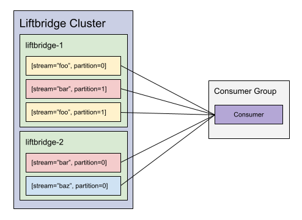
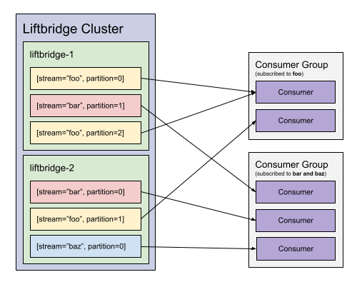
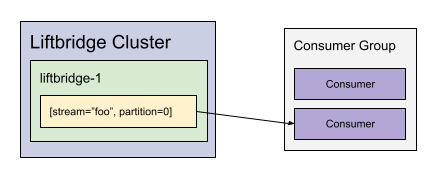
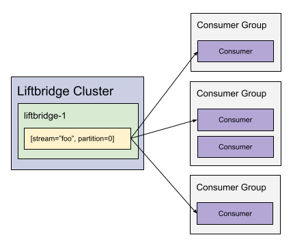

> **NOTE:** The consumer groups API is currently in beta.

Consumer groups provide higher-level consumer functionality that can be used to
solve several related problems:

1. Provide a mechanism for clients to track their position in a stream
   automatically, i.e. "durable" consumers. This builds on
   [cursors](./cursors.md) such that cursor management is transparent to users.
2. Provide a mechanism for distributed, fault-tolerant stream consumption.
3. Provide a mechanism for coordinating and balancing stream consumption by
   managing partition assignments for consumers.
4. Provide a mechanism for consuming multiple streams (and/or partitions) in
   aggregate.

When a consumer in a consumer group fails, the group's coordinator will
reassign the partitions the failed consumer was subscribed to to another member
of the group. This allows for fault-tolerant consumption of streams. Consumers
will automatically (or, if configured, explicitly), checkpoint their position
in the partitions they are consuming such that if they fail, they or another
consumer in the group can pick up where they left off.

Group coordinators are also highly available. If a server acting as the group
coordinator becomes unavailable, the consumers will report the coordinator as
failed to the [controller](#controller), prompting a new coordinator to be
selected.

Consumer groups are associated with an ID. When a consumer is created, it
specifies a group ID to join. If the group does not exist, it is created
automatically. Consumers specify a set of streams to consume. The group
coordinator then assigns stream partitions to consumers in the group. Each
partition is assigned to only one consumer in the group such that partitions
are balanced amongst the group members. In order to have multiple consumers
consuming the same partitions, separate groups should be used.

## Use Cases

Below are a few patterns that can be implemented using consumer groups.

### Aggregating Multiple Streams and/or Partitions

Normally, Liftbridge clients must subscribe to individual stream partitions. If
a client wants to consume an entire stream, it must subscribe to each of the
stream's partitions. To make matters more complicated, if the client wants to
consume _multiple_ streams, it must subscribe to all of the partitions for each
stream.

Consumer groups provide a way to consume an entire stream (or multiple streams)
with a single subscribe call. In this case, a single-member group is used by
specifying a unique group ID when creating the consumer. This means all of the
partitions for the streams the consumer subscribes to will be assigned to the
consumer because it is the sole member of the group.



### Durable Consumer

When a Liftbridge client subscribes to a partition, it must track its position
in the partition if it needs to be able to resume where it left off in the
event of a failure or shutdown. This can be done using [cursors](./cursors.md)
API, for instance. However, the cursors API is a low-level API and requires the
client to implement logic for saving its position.

Consumer groups solve this problem by automatically and transparently
checkpointing the consumer's position for the partitions it consumes. In the
event the consumer fails or shuts down, it or another member of the group can
pick up where it left off.

### Load-Balancing Stream Consumption

In Liftbridge, streams are partitioned in order to provide parallelism. This
means we can increase throughput by distributing load across multiple
partitions which can then be consumed independently by different subscribers.
This can be a lot of complexity to manage with normal subscriptions. Consumer
groups are designed to address this.

A consumer group consists of one or more consumers. The members of the group
can balance the load of a stream by having each member subscribe to the stream.
The group coordinator will then assign the stream's partitions to the members
of the group such that the load is distributed evenly across the group. Each
time a new consumer is added to the group or consumers leave the group, the
coordinator will ensure assignments are balanced.



### Fault-Tolerant Stream Consumption

In addition to balancing stream load, consumer groups also provide a means for
fault tolerance. A simple example would be a consumer group with two members,
each subscribed to the same stream. For simplicity, let's say this stream only
has a single partition. In this case, only one of the group members would
actually be assigned the partition for consumption. The other member would be
in standby, ready to take over consumption of the stream if the assigned member
fails or otherwise leaves the group. This allows us to implement highly
available stream processing.



### Publish-Subscribe

While a group can only have one consumer subscribed to a given stream partition
at a time, publish-subscribe semantics can be achieved by having multiple
consumer groups subscribed to a stream. In this case, messages on a partition
are delivered to a member of each of the subscribed groups.



## Configuring Consumer Groups

Configuration settings for consumer groups are grouped under the `groups`
namespace. See the full list of configuration options
[here](./configuration.md#consumer-groups-configuration-settings).

Consumer groups rely on [cursors](./cursors.md) which are stored in an internal
Liftbridge stream named `__cursors`. This stream is not intended to be accessed
directly. By default, the internal `__cursors` stream is disabled. To enable
it, you must set the number of partitions to something greater than 0:

```yaml
cursors.stream.partitions: 10
```

Additionally, partitions in the `__cursors` stream automatically pause when
they go idle (i.e. do not receive a cursor update or fetch) for 1 minute by
default. This can be changed or disabled with the
`cursors.stream.auto.pause.time` setting:

```yaml
cursors.stream.auto.pause.time: 0
```

There are two timeouts that can be configured on the server for consumer
groups. The first is the coordinator timeout, `groups.coordinator.timeout`,
which is used to detect coordinator failures in order to initiate failover. If
a group coordinator hasn't responded to assignment requests from a consumer for
at least this time, the consumer will report the coordinator to the controller.
If a majority of the group members report the coordinator, a new coordinator is
selected by the controller. This value defaults to 15 seconds. Adjust this
accordingly to detect coordinator failures (and thus initiate coordinator
failover) more quickly or slowly.

The second timeout is the consumer timeout, `groups.consumer.timeout`, which is
used to detect consumer failures. If a consumer hasn't sent a request to fetch
partition assignments to the group coordinator for at least this time, the
coordinator will remove the consumer from the group. This value defaults to 15
seconds. Adjust this to detect consumer failures (and thus reassign partitions)
more quickly or slowly.

```yaml
groups:
    coordinator.timeout: 30s
    consumer.timeout: 10s
```
